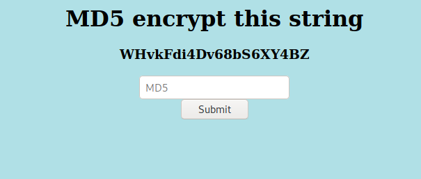
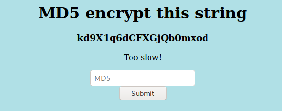

# Emdee five for life

This is a write for the Hack the box challenge Emdee five for life which requires you to get a string, hash with md5 and post it back to the server with a script.

For this script I used python3

To start, I did some reconnaissance on the page. I first looked at the home page.



Then clicked the button on the home page.



Ok so this needs to be done very quickly, for this to be as quick as needed I made a script to do this.

Before I started making the script, I knew I had to make 1 GET request to get the string to be hashed and a post.

I can assume the GET request will just get the page so all of the content, including html tags.

For the post, I just need to see the format of the data.


Ok cool! We just have to give it the hash value to get a page back.

Now lets start making a script, we will need to import 3 libraries for this.

```python
import requests
import hashlib
import re
```
I have imported requests for the GET and POST, hashlib for the md5 hash and re for a regex to clean up the page to just the text, no html tags.

To start, lets get the page and clean up the text. I found a function here:https://medium.com/@jorlugaqui/how-to-strip-html-tags-from-a-string-in-python-7cb81a2bbf44

```python
import requests
import re
import hashlib

url = 'http://134.122.108.157:32592/'
reqsesh = requests.session()

#get
get = reqsesh.get(url)
htmlout = get.text

def remove_html_tags(text):
    import re
    clean = re.compile('<.*?>')
    return re.sub(clean, '', text)

out = remove_html_tags(htmlout)
```
Now we can see the difference between htmlout and out when run in terminal.

#### htmlout

```html
b'<html>\n<head>\n<title>emdee five for life</title>\n</head>\n<body style="background-color:powderblue;">\n<h1 align=\'center\'>MD5 encrypt this string</h1><h3 align=\'center\'>mvVoJk69QZU5odOlLvlD</h3><center><form action="" method="post">\n<input type="text" name="hash" placeholder="MD5" align=\'center\'></input>\n</br>\n<input type="submit" value="Submit"></input>\n</form></center>\n</body>\n</html>\n'
```

#### out

```


emdee five for life


MD5 encrypt this string5qCtfsTKoTSLoN978ghZ


```

The html has been stripped away but we still have the rest of the text. Next I used `split()` and `Strip()` to just get the hash.

```python
out1 = out.split(' string')[1].strip()
```

Now this gives us the string to be hashed, now lets hash it. Here we also needed to encode the data to bytes.

```python
hashmd5 = hashlib.md5(out1.encode('utf-8')).hexdigest()
```
Now to post it back, I needed to make the data into a dictionary format so using `dict()`.

Send this in a post request and print the post txt and you'll get the html to the page with the flag inside.

```python
#post
postdata = dict(hash=hashmd5)
post = reqsesh.post(url=url, data=postdata)

print(post.text)
```
**Below is he entire script I used.**
```python
import requests
import re
import hashlib

url = 'http://134.122.108.157:32592/'
reqsesh = requests.session()

#get
get = reqsesh.get(url)
htmlout = get.text

def remove_html_tags(text):
    import re
    clean = re.compile('<.*?>')
    return re.sub(clean, '', text)

out = remove_html_tags(htmlout)
out1 = out.split(' string')[1].strip()
hashmd5 = hashlib.md5(out1.encode('utf-8')).hexdigest()

#post
postdata = dict(hash=hashmd5)
post = reqsesh.post(url=url, data=postdata)

print(post.text)
```
