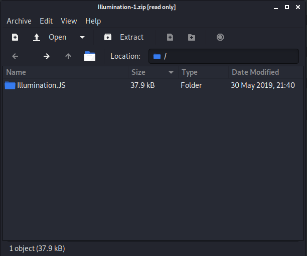
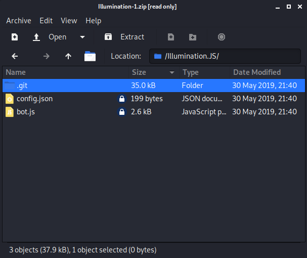
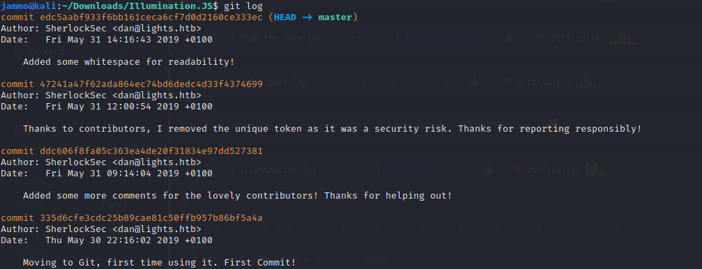
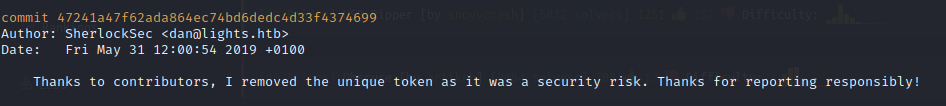

[Home](https://elliottdg.github.io/Cyber-Write-Ups)

# Illumination

This forensics challenge is by hack the box and exploits leaving security breaches in git logs.

For this challenge you should download the given file and input the password when asked for.

This is what you see when opening for the first time



Then I opened the Illumination.JS folder to see what is inside. This is what is inside.



Then I opened to see the `config.json` file as config files can always tell us something about the program we are looking at. It is useful to note at this point that one of the folders there is names `.git` meaning this is most likely a git repository.

This is what we see when opening it:

```json
{


	"token": "Replace me with token when in use! Security Risk!",

	"prefix": "~",

	"lightNum": "1337",

	"username": "UmVkIEhlcnJpbmcsIHJlYWQgdGhlIEpTIGNhcmVmdWxseQ==",

	"host": "127.0.0.1"


}
```
Hmmm, that top line is interesting. The token has been replaced for a security risk. There is a chance a developer has left this in the git logs. That's what we can look at next. To do this just traverse in the terminal into the folder holding the `.git`. This is what you'll see when you use the command:

```bash
$ git log
```


That second one down looks interesting:



This is saying that the token was removed and pushed onto the repository. Great! This means we can show this using:

```bash
$ git show 47241a47f62ada864ec74bd6dedc4d33f4374699
```
This will show an edit with the token in red showing it was removed and the text we just saw in the JSON above.

### Note
**This is in Base64 so this will need to be decoded for the flag. A good tell tale as to why is the string ending in =.**
