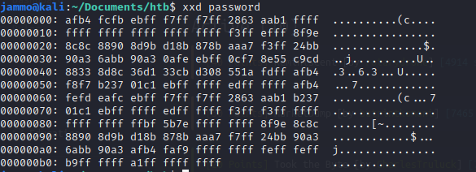
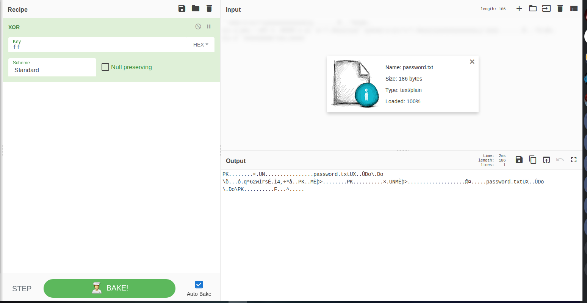
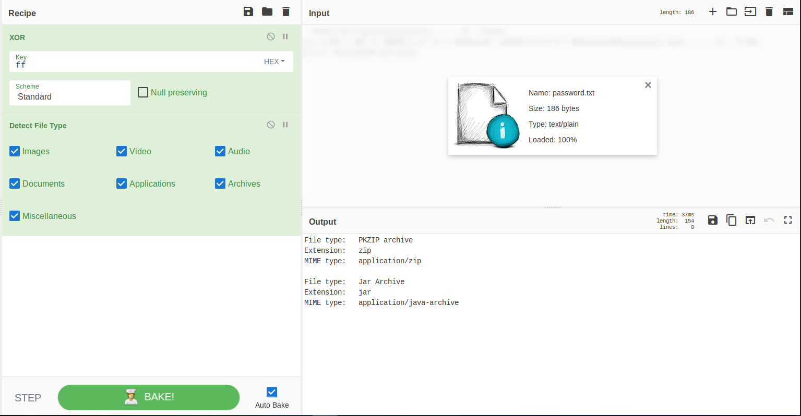
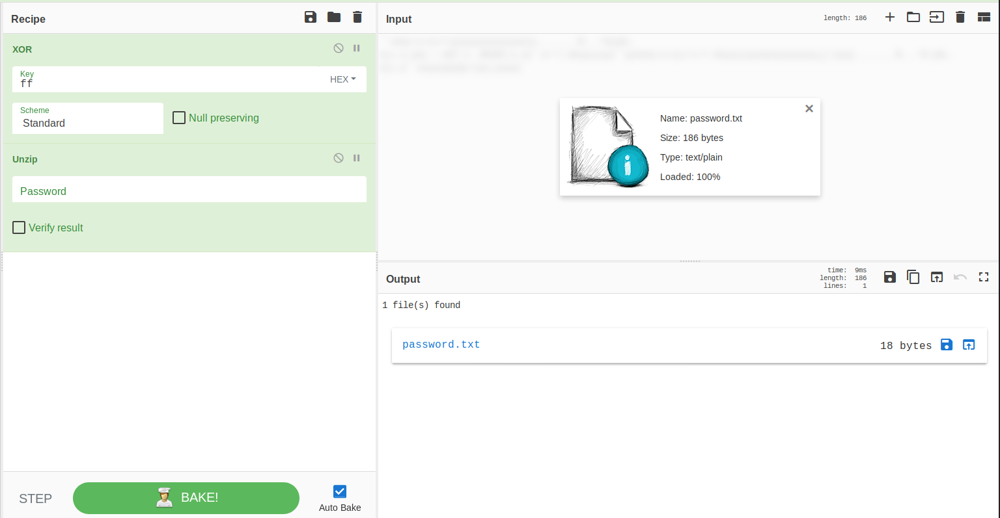

# Took The Byte

This is a hack the box challenge that looks at recovering a file by suing an XOR to find the original type.

In this challenge we get given a file called `password` and this file cannot be opened.

The first thing I did was binwalk the file to see if that would display anything but it did not.

After that the next step was to xxd the file and see what comes up. This is that below:

After seeing loads of ff, my first instinct was to XOR this with a key of ff as this is base 16.

I did this in cyber chef.

This seem to display some better text so I file checked it to see what the file is.

This is a zip file, and of course cyber Chef can unzip. This reveals a document called password.txt which holds the flag.

Click the blue `password.txt` to reveal flag.
