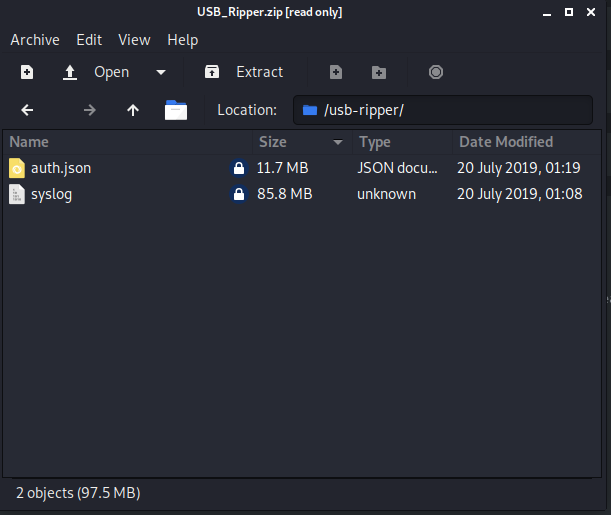

# USB RIPPER

This a write-up to the hack the box challenge USB RIPPER.

These are the files that have to be downloaded, in them are a JSON file of all the authenticated devices with their serial numbers, product numbers and manufacturer numbers.

The syslog file is a dump of all of the logs of a device that had data exfiltrated from it from a USB.

If we have both of those then we can make a script that gets the one serial number that isn't in the authenticated as that should be the devices that took the data.

This can be done with a script, I made mine in python.
