# Mr Robot CTF

Mr Robot CTF is a CTF that uses a brute force attack and linux priv esc once access is gained to a user server side.

## Flag 1

First things first, always with these I drop an nmap using `nmap -p- -T5 <ip>`. Warning doing -T5 will be very loud and slow down the network you're pinging so possibly use `-T4` or `-T3` if too much.

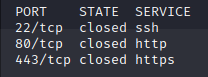

Port 22 could be used later for ssh, for sure means there is a backend server to connect to somewhere.
Ports 80 and 443 open so this is a webserver and we can go to the website.

The site gives a fake terminal with different commands playing clips or showing images. Not much we can do with it.

Putting in a random extension to the URL will show a wordpress 404 page. Knowing this we can possibly use some wordpress vulnerabilities.

Looking at the hint on key 1 being "robots" and doing a dirbuster we can see `/robots` is a 200 OK response.

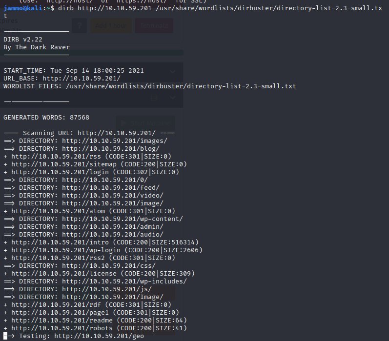

Going there reveals a file we can assess by pasting it as an extension next to the URL.

Along with this we get a .dic file which when opened is a wordlist. Possibly something that can be used later.

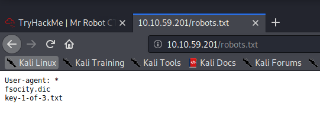

## Flag 2 & 3 (I did this in a way you can get both in the same step)

Going back to the dirbuster log we have I see 2 things that stand out. `/login` is 302 so no access but `/wp-login` is ok which probably is wordpress login.

Going to `/wp-login` confirms this.

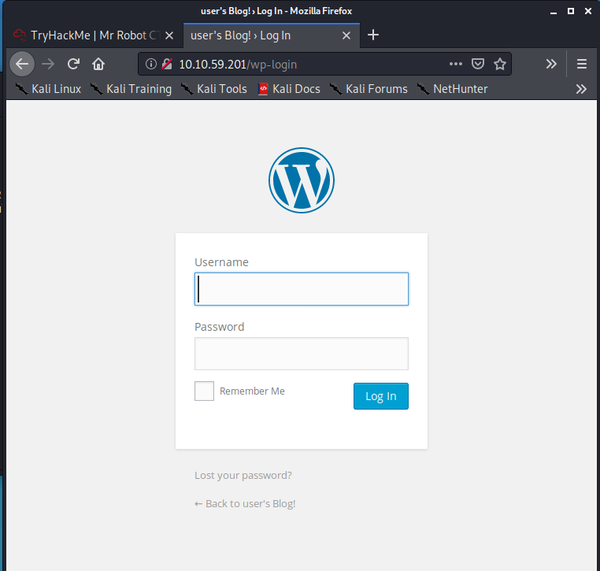

Now I'll use hydra to attack this.

From looking around the site it mentioned fsocity a lot and about joining fsocity. The wordlist we got given in robots.txt was called fsocity.dic and looking in here looks to be a lot of common names or possibly then common usernames and passwords.

I then formed a hydra command to attack the login page automatically:

```
hydra -L fsocity.dic -p password <IP>  http-post-form "/wp-login.php:log=^USER^&pwd=^PWD^:Invalid username" -t 30
```

Http-post-form sends a post request and between the "" are in the following format: `Extension:postrequest body with parameters:Error Message to ignore` with -t 30 making hydra make use of maximum tasks.

This cracked the username!

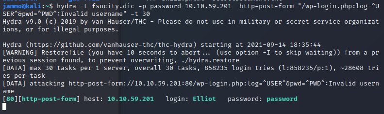

The way I got the password is a tried a bunch of things associated with the main protagonist Elliot into the password field and funnily enough his employee number worked `ER28-0652`. I did check and found that this is also in the fsocity file so you could also use hydra to brute this but anyways we're in.

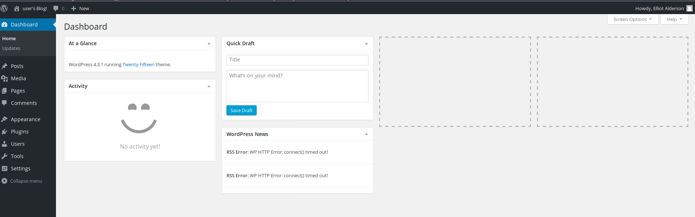

This account has access to a bunch of services including the editor.

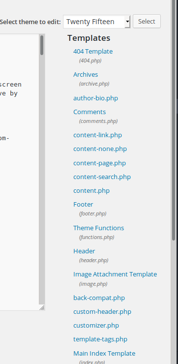

This editor is full of php files. Naturally when I see php I start thinking about a reverse shell and more importantly we can edit any code about these pages.

I think the easiest thing I could trigger is a 404 page so I dumped a reverse shell file into there instead and opened a listener and triggered a 404.

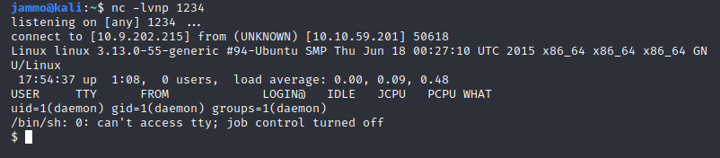

Now we are here we can look about and see what we can find.

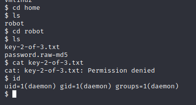

Ok so we have a file for the second key but no access. Lets check SUID and sudo perms.

Couldn't sudo but SUID check revealed nmap runs at root level and looking on GTFO bins we have an exploit.

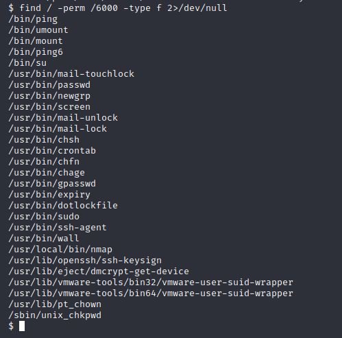

GTFO bins revealed we can use between certain versions of nmap we can use `--intercative` to gain a root shell.

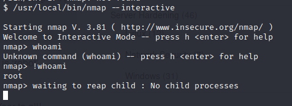

Great just run `!sh` and boom a root shell! You can then just run over and open the key 2 and the key 3 is of course in root folder :)

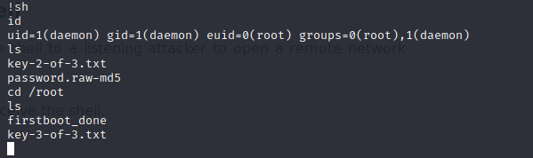
